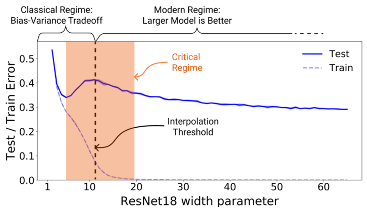

# benign-overfitting

This repository contains code to visualize the double descent phenomenon and the Neural Tangent Kernel linear approximation of deep neural network models on regression tasks. It can be used to run on your own dataset or to apply custom networks.

## Double descent

Double descent is a phenomenon where performance first improves, then gets worse, and then improves again with increasing model size, training time or data size,

here is an example of a double descent phenomenon obtained from [this paper](https://arxiv.org/pdf/1912.02292.pdf) :

 

## NTK Linear approximation

For a neural network with a function f and parameters w, we define the NTK linear approximation for x  as :

$$ \mathbf {f(x,w)} \approx\ \mathbf {f(x,w_0)+\nabla_w f(x,w_0)^T (w − w_0)} $$

$$ \mathbf {f(x,w)} \approx\ \mathbf{f(x,w_0)}- \mathbf{\nabla_w f(x,w_0)}^T \mathbf{w_0} + \langle {\mathbf{\nabla_w f(x,w_0)}^T,\mathbf{w}} \rangle$$

$$ \mathbf{\hat{f}(x,w)} \approx\ \mathbf{f(x,w_0)}-   \langle {\mathbf{\nabla_w f(x,w_0)}^T,\mathbf{w_0}} \rangle  + \langle {\mathbf{\nabla_w f(x,w_0)}^T,\mathbf{\hat{w}}} \rangle$$

 
$$ \text{since } \mathbf{\hat{w}}=\mathbf {A^T(AA^T)^{-1} y}$$

$$ \mathbf{\hat{f}(x,w)} \approx\ \langle {\mathbf{\nabla_w f(x,w_0)}^T,\mathbf{\mathbf {A^T(AA^T)^{-1} y}}} \rangle + c, \text{with } \mathbf{c}=\mathbf{f(x,w_0)}-   \langle {\mathbf{\nabla_w f(x,w_0)}^T,\mathbf{\hat{w_0}}} \rangle \text{ and } \mathbf{A=(\varphi(X_1)^T .. \varphi(X_1)^T) }$$

$$ \boxed{ \mathbf{\hat{f}(x,w)} \approx\ \langle {\mathbf{\varphi(x),\mathbf {A^T(AA^T)^{-1} y}}} \rangle = \mathbf [K(X_1,x)|... K(X_N,x)] \hat{K_N}^{-1}y +c} 
\text{,  with } \hat{K_N} = \mathbf{(K(X_i,X_j))_{1 \leqslant i,j \leqslant N}} \text{, and   } \mathbf{\varphi(x)=\nabla_w f(x,w_0)} $$

## Full List of Experiments (the Data in the links)

|Dataset| Architecture  | Optimizer | Epochs | Width interval |Data Link|Results
|:---:|:---:|:---:|:---:|:---:|:---:|:---:|
| auto-mpg with 0% and 20% label noise |2 hidden layers neural network| Adam with LR=0.001| 1000 | [1 1300] |[link](http://archive.ics.uci.edu/ml/machine-learning-databases/auto-mpg/)|[link](experiments/experiment1.md)

# License

* Free software: MIT

# Contribute

# FAQ

* Please contact us at [engineer@hi-paris.fr](engineer@hi-paris.fr)

# References

[1] NAKKIRAN, Preetum, KAPLUN, Gal, BANSAL, Yamini, et al. [Deep double descent: Where bigger models and more data hurt](https://arxiv.org/pdf/1912.02292.pdf). Journal of Statistical Mechanics: Theory and Experiment, 2021, vol. 2021, no 12, p. 124003.

[2] JACOT, Arthur, GABRIEL, Franck, et HONGLER, Clément. [Neural tangent kernel: Convergence and generalization in neural networks](https://proceedings.neurips.cc/paper/2018/file/5a4be1fa34e62bb8a6ec6b91d2462f5a-Paper.pdf). Advances in neural information processing systems, 2018, vol. 31.
