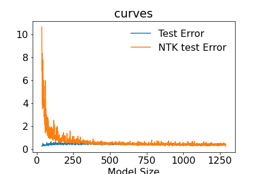

# Train and Test errors

Noisy image             |  Denoised image
:----------------------:|:-------------------------:
 |  

# Fancier Train and Test errors

0% label noise          |  20% label noise
:----------------------:|:-------------------------:
 |  

# NTK Aprroximation Train and NTK Approximation Test errors

0% label noise          |  20% label noise
:----------------------:|:-------------------------:
 |  

#  Convergence between NTK Aprroximation Test error and the Test error

0% label noise          |  20% label noise
:----------------------:|:-------------------------:
 |  